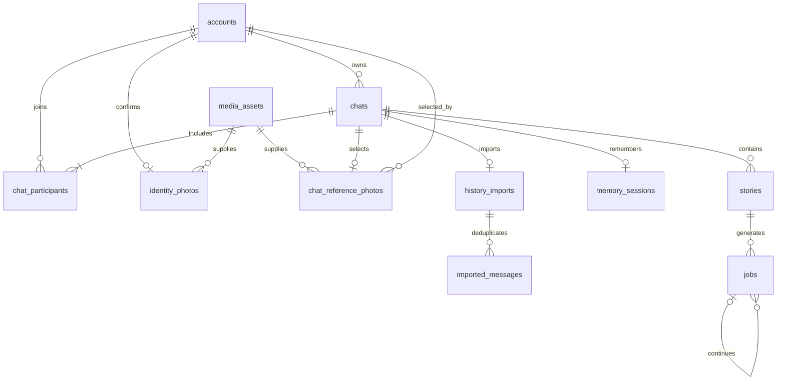

# Database

The application uses relational tables in Supabase's `public` schema, visible directly in Table Editor.

| Table | Purpose and key |
| --- | --- |
| accounts | Instagram identity; primary key `id`, unique username |
| chats | Account-owned conversation; unique `(owner_id, instagram_thread_id)` |
| chat_participants | Membership; primary key `(chat_id, account_id)` |
| identity_photos | One confirmed reference photo per account; filename references media_assets |
| chat_reference_photos | Optional friend reference selected by the chat owner; foreign keys enforce chat membership and record the confirming owner |
| history_imports | Import completeness and timestamp per chat |
| imported_messages | Deduplication and pending delivery to Honcho; primary key `(chat_id, source_message_id)` |
| memory_sessions | Current Honcho session and reset generation per chat |
| stories | A video story belonging to one chat |
| jobs | Instructions, reference media, provider task, output, lifecycle, and delivery |
| media_assets | Immutable photo/video bytes (`bytea`), content type, byte length, SHA-256 and creation time; filename primary key |

Jobs use UUID primary keys. Foreign keys enforce chat membership, ownership, story association, and continuation within the same chat/story. `(chat_id, idempotency_key)` prevents repeated generation; `(chat_id, delivery_message_id)` prevents duplicate delivery records. Status/stage checks reject invalid lifecycle states. Chat chronology, active jobs, participant lookup, and pending imports have indexes. `generation_spec` is the one JSONB column: a bounded structured model output, not a general-purpose record store.

Transactions commit changes atomically. API reads use a consistent database snapshot. RLS is enabled without browser policies; the local backend connects directly. The application still needs server-side user authentication before exposing its API as a hosted multi-user service.

`npm run db:migrate` applies the ordered SQL files in `apps/web/migrations/`. The one-time migration copied the former generic records into these tables, verified their fields, saved an ignored backup, and removed `us_app.records`. No runtime compatibility or local-file storage path remains. `npm run test:database` checks actual database constraints in a transaction that is rolled back. It never calls a generation provider.

For this small demo, photo/video bytes are stored directly in Postgres and served with HTTP range support from `/api/media/`. Media blobs are queried separately and are never loaded into the app state snapshot. Photo metadata references existing media rows with foreign keys. Runtime storage does not read or create `data/`. The bundled prerecorded fixture is a static application asset seeded into Postgres once.
